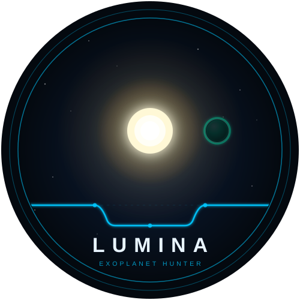
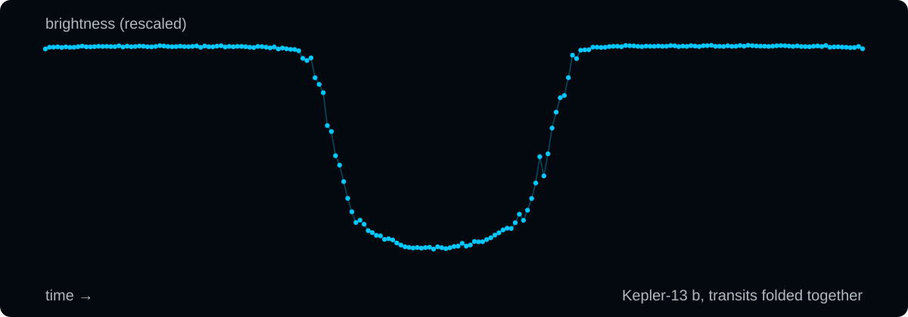

<div align="center">



# Lumina

**Lend your computer's spare time to the search for planets around other stars.**

[](LICENSE)
[](#where-things-stand)
[](#where-does-the-data-come-from)

The installer isn't out yet. **Watch** or **star** this repository to hear when it is.

</div>

NASA's Kepler telescope spent years measuring the brightness of hundreds of
thousands of stars, and all of that data is public. A planet shows up in it as
a tiny dip in its star's light that comes back every orbit. Thousands of
planets have been found that way, and going back through the archive with new
tools still finds more: NASA's own ExoMiner model
[added 301 Kepler planets](https://www.nasa.gov/missions/kepler/new-deep-learning-method-adds-301-planets-to-keplers-total-count/)
in 2021.

Lumina is my go at that search, spread across volunteers' computers instead of
one big one. You install it, it works through stars in the background while
you get on with your day, and anything that looks like a planet goes to people
for a proper look. Lumina is an independent project. It isn't run by NASA, and
NASA hasn't endorsed it.

## What a planet looks like in the data

<p>

</p>

<sub>Kepler-13 b, a confirmed planet, as Lumina sees it: every transit in the
Kepler data folded on top of each other. The vertical scale is stretched so the
dip is easy to see. Drawn from Lumina's own preprocessed Kepler data.</sub>

That dip is the planet passing in front of its star and blocking a little of
its light, often less than one percent. One dip on its own could be anything.
A dip that repeats on a fixed schedule, with the same depth and shape every
time, is what a planet looks like. That's the pattern Lumina hunts for, star by
star.

## Your computer does the searching

This is how it will work once the installer is out:

1. You install Lumina on a Windows PC. No astronomy or programming needed.
2. It runs quietly in the background.
3. It gets a batch of stars from the network, which is called ExoNet.
4. It downloads those stars' brightness records from NASA's public archive and
   looks for repeating dips.
5. It sends back anything that looks like a planet.

The more computers join, the faster the search goes.

## What happens when it finds something

Your computer flags it as a **candidate**: something that might be a planet.
It isn't a planet yet. A candidate has to be reviewed by experts and then
confirmed, by follow-up observation or statistical validation, before it
counts.

You also get to give your candidate a nickname. The nickname stays attached to
it inside ExoNet, and only there. Official names for exoplanets come from the
International Astronomical Union's own naming campaigns
([NameExoWorlds](https://www.nameexoworlds.iau.org/)), and finding something
through Lumina doesn't make anyone eligible for one.

## Watch it work

Every computer running Lumina gets its own dashboard, a page you open in your
browser. It runs entirely on your machine, with no account and no internet
connection needed to look at it. It shows which stars you're working on, how
many are done, brightness curves as they're processed, and anything your
computer has flagged.

[Mission Control](https://mbarc.github.io/Lumina-Exoplanet-Hunter/) is the
view of the whole network. It will start filling up once the installer is out
and the first volunteers join.

## Where things stand

I'm building Lumina on my own, and it's still in development.

| Mission | Status |
|---|---|
| Kepler | The detection model is trained and tested on Kepler data |
| K2 | Planned |
| TESS (Transiting Exoplanet Survey Satellite) | Planned, and next in line |

The current Kepler training set has 162,687 possible signals from 53,634
stars. 2,026 of those line up with planets and planet candidates already in
NASA's catalogue, and those are what the model learns a planet looks like
from.

The model isn't as accurate as published Kepler models yet. Treat anything it
flags as a lead worth checking, not a discovery.

## FAQ

### Is this a NASA project?

No. Lumina uses NASA's public data, but it's an independent volunteer project.
Nobody at NASA runs it or has endorsed it.

### Is it free?

Yes. There's no account and nothing to pay. The code is open source under the
MIT licence, so anyone can read it and check what it does.

### Will it slow down my computer?

It's designed to run in the background on spare computing time. I'll publish
exactly what it uses once there's a release to measure.

### Where does the data come from?

The brightness records come from NASA's public archive of Kepler data, the
Mikulski Archive for Space Telescopes (MAST). The list of known planets and
candidates that the model learns from comes from the NASA Exoplanet Archive.

### Does it work on a Mac?

Not at first. The installer is Windows only.

### Can I help without installing anything?

Yes. If you'd like to work on the detection model, add another mission, or use
the candidate data in your own research,
[open an issue](https://github.com/MBarc/Lumina-Exoplanet-Hunter/issues)
(GitHub's name for a request or bug report) or send a pull request.

## For developers

Lumina is Python throughout.

```text
ml/           the ExoNet detection model: preprocessing, training, calibration, inference
data_tools/   downloading Kepler light curves (FITS files) from MAST
api/          the ExoNet coordination API (FastAPI and MongoDB)
scheduler/    the service that hands out batches of stars
dashboard/    the local dashboard each volunteer computer runs
services/     the Windows background service
Installer/    the Windows installer
docs/         Mission Control, published with GitHub Pages
branding/     logo, colours and images
```

## Licence

MIT, see [LICENSE](LICENSE).

## Legal

Lumina is an independent project and is not affiliated with, endorsed by, or
supported by NASA or any other space agency. Kepler data is provided by the
Mikulski Archive for Space Telescopes (MAST) and the NASA Exoplanet Archive.
